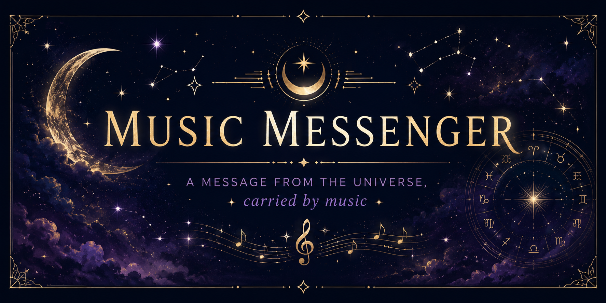

# ✨ Music Messenger

<p align="center">
  
</p>

<p align="center">
  
</p>

> *Everything moves in harmony with the rhythm of the universe.*

<p align="center">
  🌙 ✦ ˚ · . <strong>A musical message is waiting for you.</strong> . · ˚ ✦ 🌌
</p>

Music Messenger is an interactive Python CLI application that transforms Spotify's music library into a symbolic and spiritual messaging experience.

Rather than predicting the future, Music Messenger invites you to pause, reflect, and discover meaning through music. The universe can choose a melody for you, or you can guide the journey through a genre, artist, or album.

Each song carries its own atmosphere. And sometimes, a single lyric is all you need to hear.

---

## 🌌 The Musical Journey

```text
              ✦ THE UNIVERSE ✦
                     │
                     ▼
          ┌─────────────────────┐
          │   Choose Your Path  │
          └─────────────────────┘
             │    │    │    │
             ▼    ▼    ▼    ▼
          🌌    🎵    🎤    💿
       Universe Genre Artist Album
             │    │    │    │
             └────┴────┴────┘
                     │
                     ▼
              🎵 A Melody
                     │
                     ▼
             🎶 A Lyric Message
                     │
                     ▼
              ✦ Reflection ✦
```

---

## ✨ Features

🌌 **Universe Mode**
Let the universe guide the journey through thematic musical paths.

🎵 **Genre Discovery**
Choose a genre and let Spotify reveal a melody.

🎤 **Artist Discovery**
Explore the musical universe of an artist of your choice.

💿 **Album Discovery**
Choose an album and discover a song hidden within it.

🎶 **Lyric Messages**
Receive an optional lyric from the selected song as a deeper message.

🔮 **Continuous Journey**
Keep receiving musical messages without restarting the application.

🔐 **Spotify OAuth**
Securely connects the application to the Spotify Web API.

---

## 🌙 Celestial Paths

Each Universe Mode path represents a different atmosphere:

| Path                      | Energy                                  |
| ------------------------- | --------------------------------------- |
| 🌙 **Dark Academia**      | Mystery, knowledge & introspection      |
| ✨ **Spiritual Awakening** | Reflection, consciousness & inner peace |
| 🌊 **Chill & Reflection** | Calm, solitude & contemplation          |
| ⚔️ **Epic Journey**       | Adventure, courage & discovery          |
| 🌌 **Cosmic Dreams**      | Space, dreams & imagination             |
| 🔥 **Energy & Passion**   | Movement, confidence & intensity        |
| 💔 **Emotional Heart**    | Love, vulnerability & emotion           |
| 🌿 **Nature & Peace**     | Earth, simplicity & serenity            |
| 🌃 **Midnight Thoughts**  | Night, mystery & introspection          |
| ☀️ **Happiness & Light**  | Joy, optimism & energy                  |

---

## 🪐 How It Works

```text
      User
       │
       ▼
  Choose a Path
       │
       ▼
 ┌───────────────┐
 │ Spotify API   │
 └───────────────┘
       │
       ▼
  Discover Song
       │
       ▼
 ┌───────────────┐
 │   Optional    │
 │ Lyric Message │
 └───────────────┘
       │
       ▼
 ✦ Musical Reflection ✦
```

---

## 🛠️ Built With

* 🐍 **Python**
* 🎵 **Spotify Web API**
* 🎧 **Spotipy**
* 🎶 **LRCLIB**
* 🔐 **python-dotenv**
* 🌐 **Requests**
* 🧩 **Git & GitHub**

---

## 🚀 Getting Started

### Clone the repository

```bash
git clone https://github.com/Berinfinity/music-messenger.git
cd music-messenger
```

### Create a virtual environment

```bash
python -m venv .venv
```

Activate it on Windows PowerShell:

```powershell
.venv\Scripts\Activate.ps1
```

### Install dependencies

```bash
pip install -r requirements.txt
```

### Configure Spotify

Create a `.env` file in the project root:

```env
CLIENT_ID=your_spotify_client_id
CLIENT_SECRET=your_spotify_client_secret
REDIRECT_URI=http://127.0.0.1:1111/callback/musicmessenger
```

> 🔐 Never commit your `.env` file or expose your Spotify credentials.

### Begin the journey

```bash
python main.py
```

---

## 🔮 Future Plans

### ✦ Version 2 — A Deeper Journey

* 🎨 Graphical User Interface
* 🌌 Immersive celestial visual design
* 🎴 Tarot-inspired message presentation
* ✨ Expanded spiritual paths
* 🎵 Improved music discovery
* 🌙 More personalized musical experiences

---

## 📜 License

This project is licensed under the MIT License.

---

<p align="center">
  ✦ ˚₊‧ ☾ ⋆｡°✩ ⋆｡°✩ ☽ ‧₊˚ ✦
  <br>
  <i>Sometimes the universe speaks through music.</i>
  <br>
  ✦ ˚₊‧ ☾ ⋆｡°✩ ⋆｡°✩ ☽ ‧₊˚ ✦
</p>
